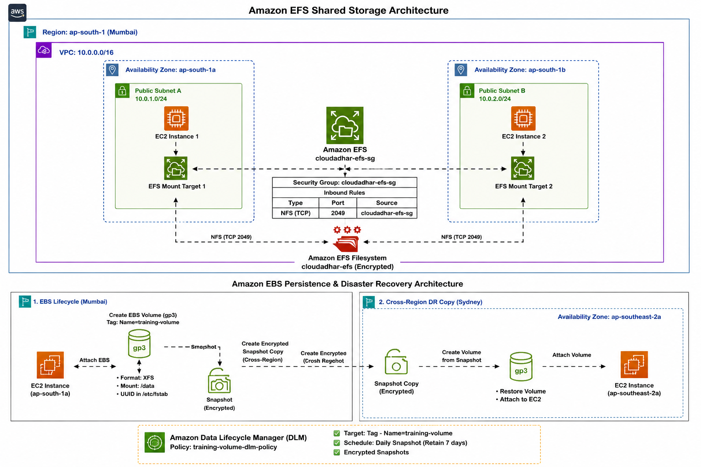

# Week 4 -- AWS Storage, Recovery & Placement Groups

Hands-on AWS lab covering **Amazon EBS, EBS Snapshots, Data Lifecycle
Manager (DLM), Amazon EFS, and EC2 Placement Groups**.

> **Security note:** Mask AWS account IDs, ARNs, IP addresses,
> instance/volume/AMI/snapshot IDs, metadata tokens, credentials,
> private keys, billing information, and organization URLs before
> publishing screenshots.

## 1. Objectives

-   Persistent Amazon EBS storage attached to EC2
-   XFS filesystem and UUID-based mounting
-   Persistent mounts with `/etc/fstab`
-   EBS resize and XFS growth
-   Point-in-time snapshot and recovery validation
-   Encrypted cross-Region snapshot copy
-   Amazon Data Lifecycle Manager (DLM)
-   Shared Amazon EFS storage across two EC2 instances
-   EFS NFS TCP `2049` connectivity
-   Persistent EFS mounting after reboot
-   EC2 Placement Groups: Cluster, Spread, and Partition

## 2. Architecture



### EBS Persistence & Disaster Recovery

``` text
Mumbai (ap-south-1)
        |
    EC2 Instance
        |
    EBS gp3 Volume
        |
    XFS filesystem
        |
   UUID + /etc/fstab
        |
   Persistent mount
        |
    EBS Snapshot
        |
 Encrypted cross-Region copy
        |
        v
Sydney (ap-southeast-2)
        |
 Restored EBS Volume
```

### EFS Shared Storage

``` text
             Amazon EFS
            /               Mount Target     Mount Target
        AZ 1a            AZ 1b
          |                |
        EC2-1            EC2-2
          \                /
           \-- NFS 2049 --/
                 |
             /mnt/efs
```

Both EC2 instances successfully read files written by the other client.

## 3. EBS Lifecycle

### Create, format, and mount

A `gp3` EBS volume was attached to Ubuntu EC2, formatted as XFS, and
mounted at `/data`.

Verification:

``` bash
lsblk
sudo blkid /dev/<device>
findmnt /data
df -h /data
```

Persistent configuration:

``` text
UUID=<filesystem-uuid> /data xfs defaults,nofail 0 2
```

The instance was rebooted and `/data` was verified to mount
automatically.

### Safety lesson

Always verify the target block device before running `mkfs`.

**Never run `mkfs` on a restored volume when the objective is data
recovery.** A restored EBS volume already contains the filesystem and
data captured by the snapshot.

## 4. EBS Resize & XFS Growth

The EBS volume was resized:

``` text
2 GiB → 4 GiB
```

The XFS filesystem was expanded without recreating it:

``` bash
sudo xfs_growfs /data
df -h /data
```

This demonstrates that EBS block-device capacity expansion and
filesystem expansion are separate operations.

## 5. Snapshot & Point-in-Time Recovery

A file was created before the snapshot:

``` bash
echo "BEFORE-SNAPSHOT" | sudo tee /data/before-snapshot.txt
cat /data/before-snapshot.txt
```

After the snapshot, additional data was created.

The snapshot was restored into a new EBS volume and mounted separately
for recovery.

Validation confirmed:

-   `before-snapshot.txt` was recovered.
-   Data created after the snapshot was absent from the restored
    point-in-time copy.

``` text
Before snapshot
      |
      +-- before-snapshot.txt
      |
    SNAPSHOT
      |
      +-- after-snapshot.txt
      |
    RESTORE
      |
      +-- before-snapshot.txt  ✓
      +-- after-snapshot.txt   ✗
```

## 6. Cross-Region Disaster Recovery

An encrypted snapshot copy was created from:

``` text
Mumbai: ap-south-1
```

to:

``` text
Sydney: ap-southeast-2
```

The copied snapshot can be used to restore EBS storage in the secondary
Region.

## 7. Data Lifecycle Manager

An Amazon Data Lifecycle Manager policy was configured to target the
intended training volume using a resource tag:

``` text
Name = Week4-Ubuntu-Training
```

The policy was configured for scheduled snapshot management and
retention.

Using tags makes lifecycle policies easier to manage without hard-coding
individual volume IDs.

## 8. Amazon EFS

An encrypted EFS filesystem was created with mount targets across
multiple Availability Zones in the Mumbai Region.

The EC2 security configuration allowed:

``` text
NFS / TCP / 2049
```

Connectivity was validated with:

``` bash
nc -zv -w 3 <efs-ip> 2049
```

A successful connection confirmed network access to the EFS mount
target.

## 9. EFS Mount

The filesystem was mounted using NFS 4.1:

``` bash
sudo mkdir -p /mnt/efs

sudo mount -t nfs4 -o nfsvers=4.1 <efs-dns-name>:/ /mnt/efs
```

Verification:

``` bash
findmnt /mnt/efs
```

The filesystem type was confirmed as `nfs4`.

## 10. Shared EFS Validation

### EC2-1 → EFS → EC2-2

EC2-1 wrote:

``` bash
echo "Hello from EC2-1" | sudo tee /mnt/efs/from-ec2-1.txt
```

EC2-2 read:

``` bash
cat /mnt/efs/from-ec2-1.txt
```

Result:

``` text
Hello from EC2-1
```

### EC2-2 → EFS → EC2-1

EC2-2 wrote:

``` bash
echo "Hello from EC2-2" | sudo tee /mnt/efs/from-ec2-2.txt
```

EC2-1 read:

``` bash
cat /mnt/efs/from-ec2-2.txt
```

Result:

``` text
Hello from EC2-2
```

This proves both EC2 instances were accessing the same shared
filesystem.

## 11. Persistent EFS Mount

The EFS filesystem was added to `/etc/fstab`:

``` text
<efs-dns-name>:/ /mnt/efs nfs4 defaults,_netdev,nofail 0 0
```

The configuration was tested:

``` bash
sudo mount -a
```

After reboot:

``` bash
findmnt /mnt/efs
```

confirmed that EFS was automatically mounted.

`_netdev` identifies the mount as network-dependent, while `nofail`
helps prevent an unavailable network filesystem from blocking boot.

## 12. Placement Groups

### Cluster

``` text
Week4-Cluster
```

Purpose: low latency and high network performance for tightly coupled
workloads.

### Spread

``` text
Week4-Spread
```

Spread level: `Rack`

Purpose: failure isolation by distributing instances across separate
underlying hardware.

### Partition

``` text
Week4-Partition
```

Partition count: `2`

Purpose: isolate groups of instances for distributed workloads.

### Quick reference

  Strategy    Main purpose
  ----------- ----------------------------------------
  Cluster     Low latency / high network performance
  Spread      Failure isolation
  Partition   Distributed workload isolation

## 13. Requirement → Choice → Reason

  -----------------------------------------------------------------------
  Requirement             AWS choice              Reason
  ----------------------- ----------------------- -----------------------
  Persistent block        EBS gp3                 Durable EC2 block
  storage                                         storage

  Stable mount            UUID + `/etc/fstab`     Persistent mount
                                                  configuration

  Increase capacity       EBS resize + XFS growth Expand without
                                                  recreating filesystem

  Point-in-time recovery  EBS Snapshot            Backup and restore

  Cross-Region DR         Encrypted snapshot copy Recovery in another
                                                  Region

  Automated retention     DLM                     Tag-based lifecycle
                                                  management

  Shared storage          EFS                     Multiple EC2 clients
                                                  access the same data

  EFS network access      NFS TCP 2049            Required NFS
                                                  connectivity

  Low-latency workload    Cluster                 Close placement

  Failure isolation       Spread                  Separate underlying
                                                  hardware

  Distributed workload    Partition               Infrastructure
                                                  partitioning
  -----------------------------------------------------------------------

## 14. Evidence Checklist

-   [x] EBS gp3 volume
-   [x] XFS filesystem
-   [x] UUID-based mount
-   [x] `/etc/fstab` persistence
-   [x] EBS resize from 2 GiB to 4 GiB
-   [x] XFS filesystem growth
-   [x] Snapshot creation
-   [x] Snapshot restoration
-   [x] Pre-snapshot data recovery
-   [x] Post-snapshot data absent from restored point-in-time copy
-   [x] Encrypted cross-Region snapshot copy
-   [x] DLM tagged-volume policy
-   [x] EFS mount targets
-   [x] TCP 2049 security-group access
-   [x] EFS mounted on two EC2 instances
-   [x] Two-way shared-file validation
-   [x] Persistent EFS mount after reboot
-   [x] Cluster placement group
-   [x] Spread placement group
-   [x] Partition placement group
-   [x] Lab cleanup after validation

## 15. Recommended Evidence Screenshots

1.  EBS volume creation
2.  `lsblk` and XFS/UUID verification
3.  `/data` persistent mount
4.  EBS resize and XFS growth
5.  Snapshot available
6.  Restored volume and recovered file
7.  Point-in-time recovery validation
8.  Sydney encrypted snapshot copy
9.  DLM policy targeting the training volume
10. EFS filesystem and mount targets
11. NFS TCP 2049 security-group rule
12. EFS mount on EC2-1
13. EFS mount on EC2-2
14. EC2-1 reading EC2-2's file
15. EC2-2 reading EC2-1's file
16. EFS mount after reboot
17. Placement Groups showing Cluster, Spread, and Partition

## 16. Publishing Checklist

Before uploading screenshots to GitHub or LinkedIn, mask:

-   AWS account IDs
-   ARNs
-   Public/private IP addresses
-   Instance IDs
-   Volume IDs
-   AMI IDs
-   Snapshot IDs
-   Metadata tokens
-   Credentials
-   Private keys
-   Billing information
-   Organization/internal URLs

## 17. Key Lessons

-   EBS provides persistent block storage for EC2.
-   UUID-based mounts are preferable to relying on changing NVMe device
    names.
-   EBS volume resize and filesystem growth are separate operations.
-   EBS snapshots provide point-in-time recovery.
-   Restored volumes must not be reformatted when recovering data.
-   DLM can automate snapshot lifecycle management using tags.
-   EFS provides shared file storage for multiple EC2 clients.
-   EFS requires NFS connectivity over TCP 2049.
-   `/etc/fstab` can make EFS mounts persistent across reboots.
-   Cluster, Spread, and Partition solve different placement
    requirements.

## 18. Final Outcome

The lab demonstrated a practical AWS storage workflow:

``` text
EBS
 ├── gp3
 ├── XFS
 ├── UUID
 ├── /etc/fstab
 ├── Resize
 ├── Snapshot
 ├── Recovery
 ├── Cross-Region DR
 └── DLM

EFS
 ├── Mount Targets
 ├── NFS 2049
 ├── EC2-1
 ├── EC2-2
 ├── Shared Files
 └── Persistent Mount

Placement Groups
 ├── Cluster
 ├── Spread
 └── Partition
```

Lab resources were cleaned up after validation to avoid unnecessary AWS
charges.

## AWS Services Used

-   Amazon EC2
-   Amazon EBS
-   Amazon EBS Snapshots
-   Amazon Data Lifecycle Manager
-   Amazon EFS
-   Amazon VPC / Security Groups
-   EC2 Placement Groups

------------------------------------------------------------------------

**10 Weeks of AWS -- Week 4, Day 8**

Hands-on learning focused on AWS storage, recovery, shared filesystems,
lifecycle management, and placement strategies.

#AWS #AmazonEBS #AmazonEFS #EC2 #CloudArchitecture #CloudComputing
#DevOps #AWSLearning #10WeeksOfAWS
