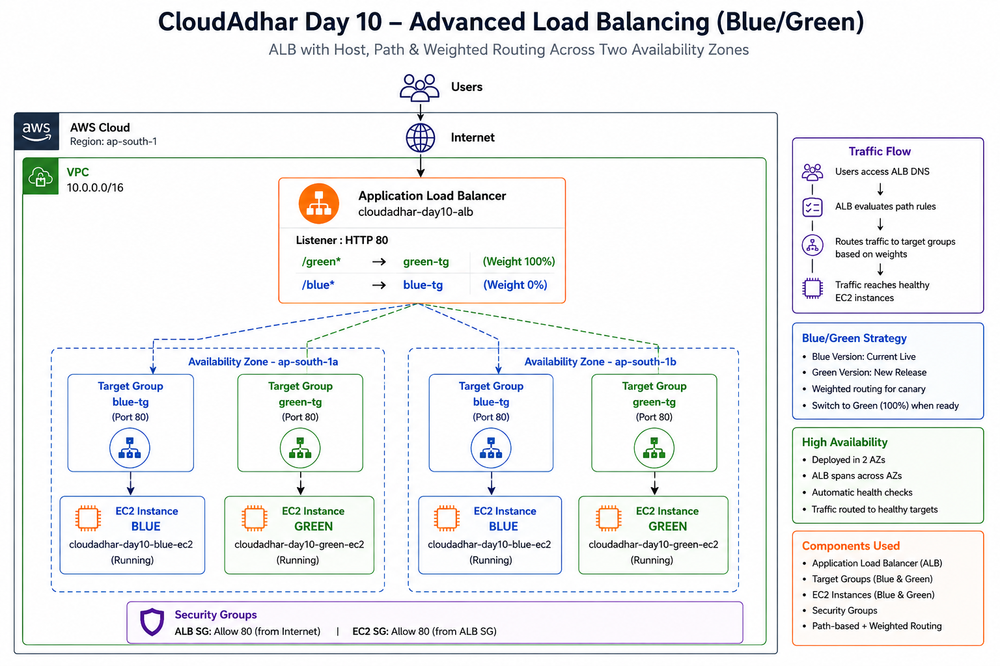

# Week 5 — Day 10: AWS Load Balancing & Blue/Green Routing

## Week 5, Day 10 of #10WeeksOfAWS

Today I worked with **AWS Elastic Load Balancing**, mainly an **Application Load Balancer (ALB)**, and practiced:

- ALB listener configuration
- Target groups
- Target health checks
- Path-based routing
- Weighted routing
- Blue/Green deployment simulation
- Traffic shifting from Blue to Green
- Validation across Availability Zones
- Security-group relationships
- Final cleanup of lab resources

---

## 1. ALB vs NLB vs GWLB

| Requirement | Choice | Reason |
|---|---|---|
| HTTP/HTTPS host, path, header, query routing | **ALB** | Layer 7 HTTP-aware routing |
| TCP/TLS/UDP and static zonal IP requirements | **NLB** | Layer 4 networking |
| Security appliance / traffic inspection | **GWLB** | Designed for virtual network/security appliances |

For this lab, **ALB** was selected because the practical required HTTP path routing and weighted Blue/Green traffic shifting.

---

# 2. Architecture

```text
                         Internet / Client
                                |
                                v
                  +---------------------------+
                  |   Application Load        |
                  |       Balancer            |
                  |   cloudadhar-day10-alb    |
                  +-------------+-------------+
                                |
                           HTTP : 80
                           ALB Listener
                                |
                +---------------+----------------+
                |                                |
         Path = /green                      Default rule
                |                           Weighted routing
                v                                |
       +-------------------+              +-------+-------+
       | GREEN Target      |              |               |
       | Group             |              |               |
       | Healthy EC2       |              |               |
       | ap-south-1b       |              |               |
       +---------+---------+              |               |
                 |                        |               |
                 v                        v               |
          GREEN VERSION              BLUE Target Group    |
                                       Healthy EC2        |
                                       ap-south-1a        |
                                                        |
                                       GREEN Target Group
```

---

# 3. Target Groups

Two target groups were created:


Configuration:

- Target type: **Instance**
- Protocol: **HTTP**
- Port: **80**
- Health checks enabled
- One healthy target in each target group
- Targets placed in different Availability Zones

### Green target group proof

The Green target group showed:

- Total targets: **1**
- Healthy: **1**
- Unhealthy: **0**
- Target port: **80**
- Availability Zone: **ap-south-1b**


### Blue target group proof

The Blue target group showed:

- Total targets: **1**
- Healthy: **1**
- Unhealthy: **0**
- Target port: **80**
- Availability Zone: **ap-south-1a**


---

# 4. Application Validation

## Blue Version

The ALB endpoint was opened in the browser and returned:

**BLUE VERSION**

This confirmed that the Blue application was working.


---

## Green Version

The `/green` path was opened and returned:

**GREEN VERSION**

The response also displayed the Green EC2 instance information and Availability Zone.


---

# 5. ALB Listener Configuration

The ALB used an **HTTP : 80** listener.

The listener contained two rules.

### Rule 1 — Path-Based Routing

Condition:

```text
Path = /green
```

Action:

```text
Forward to cloudadhar-day10-green-tg
```

This means requests such as:

```text
http://<ALB-DNS>/green
```

are sent directly to the Green target group.

### Rule 2 — Default Rule

Requests that do not match `/green` use the default action.

The default action was configured for **weighted forwarding** between:

- Blue target group
- Green target group


This is one of the most important screenshots because it proves both path-based and weighted routing.

---

# 6. Weighted Blue/Green Routing

The initial weighted configuration was:

```text
Blue  = 80%
Green = 20%
```

The ALB distributed default traffic according to these weights.

The `/green` rule was kept separate and continued to route directly to Green.

### Important distinction

The weighted rule controls the **default traffic**.

The `/green` rule is a **specific path rule**, so `/green` requests go directly to Green rather than following the default weights.

---

# 7. Troubleshooting During Traffic Validation

During browser testing, the responses did not appear in a perfectly predictable order.

For example, repeated requests produced observations such as:

```text
Blue
Blue
Blue
Green
Blue
...
```

At another point, the browser appeared to return Green repeatedly.

### Why this happened

Weighted routing is not a guarantee that every small number of browser refreshes will exactly match the configured percentage.

An 80/20 configuration represents the intended distribution over a larger number of requests. A small sample can naturally contain more Blue or more Green responses.

Browser caching, connection reuse and the small sample size can also make the result appear inconsistent.

### What I verified

Instead of relying only on the visual sequence, I verified the actual ALB listener configuration and confirmed that:

```text
Default:
Blue 80%
Green 20%

/green:
Green 100%
```


---

# 8. Traffic Shift — Green 100%

After validating the Blue/Green setup, the default listener weights were changed to:

```text
Blue  = 0%
Green = 100%
```

The `/green` rule was not changed.

After saving the listener configuration, the ALB endpoint returned the:

**GREEN VERSION**

page.

This demonstrated a Blue → Green deployment cutover.


---

# 9. Final Listener State

The final listener configuration showed:

```text
/green path rule
        ↓
Green target group — 100%

Default rule
        ↓
Green target group — 100%
Blue target group  — 0%
```

The listener modification was successfully confirmed by AWS.

---

# 10. Security Group Validation

The EC2 instance security configuration was also checked.

The instance had an inbound HTTP rule allowing traffic from the ALB security group.

This is important because the recommended architecture is:

```text
Internet
   |
   v
ALB Security Group
   |
   v
EC2 Security Group
```

The application instances should receive application traffic through the ALB rather than being directly exposed as the production entry point.


---


# 15. Key Learnings

### ALB

ALB works at Layer 7 and can make routing decisions using HTTP information such as:

- Path
- Host
- HTTP headers
- Query strings

### Target Groups

Target groups provide the backend destinations for ALB traffic and perform health checks against registered targets.

### Weighted Routing

Weighted forwarding can gradually shift traffic between application versions.

Example:

```text
Blue 90% / Green 10%
Blue 80% / Green 20%
Blue 50% / Green 50%
Blue 10% / Green 90%
Blue 0%  / Green 100%
```

### Blue/Green Deployment

Blue/Green deployment allows a new version to be validated separately and then promoted by changing traffic routing.

### Health Checks

Traffic should be sent only to healthy targets.

---

# 16. Final Result

The Day 10 practical successfully demonstrated:

- Application Load Balancer setup
- HTTP listener on port 80
- Path-based routing
- Weighted Blue/Green routing
- Healthy target validation across two Availability Zones
- Traffic shifting from Blue to Green
- Final Green 100% cutover
- Troubleshooting of weighted-routing observations
- Security-group validation
- Resource cleanup


### What I practiced:

🔹 ALB vs NLB vs GWLB decision making  
🔹 Target Groups and health checks  
🔹 HTTP listener configuration  
🔹 Path-based routing using `/green`  
🔹 Weighted Blue/Green traffic — 80/20  
🔹 Traffic shifting from Blue → Green  
🔹 Final Green 100% cutover  
🔹 Validation across two Availability Zones  
🔹 Security Group configuration  
🔹 AWS resource cleanup  
