# CloudAdhar Day 13 — Complete AWS RDS Documentation

> **Complete task-wise documentation with practical evidence, screenshots, architecture, validation and cleanup checklist.**

---

CLOUDADHAR DAY 13

RDS, Aurora Serverless v2, Recovery & RDS Proxy

Practical Documentation with Embedded Architecture & Evidence Screenshots

AWS Region: ap-south-1 | Training / Synthetic Data

## 1. Architecture

The Day 13 design keeps database resources private and connects to them through controlled VPC security-group paths, TLS, Session Manager, backups and managed automation.

Day 13 AWS architecture — RDS, Aurora Serverless v2, RDS Proxy, SSM, S3, Secrets Manager and CloudWatch

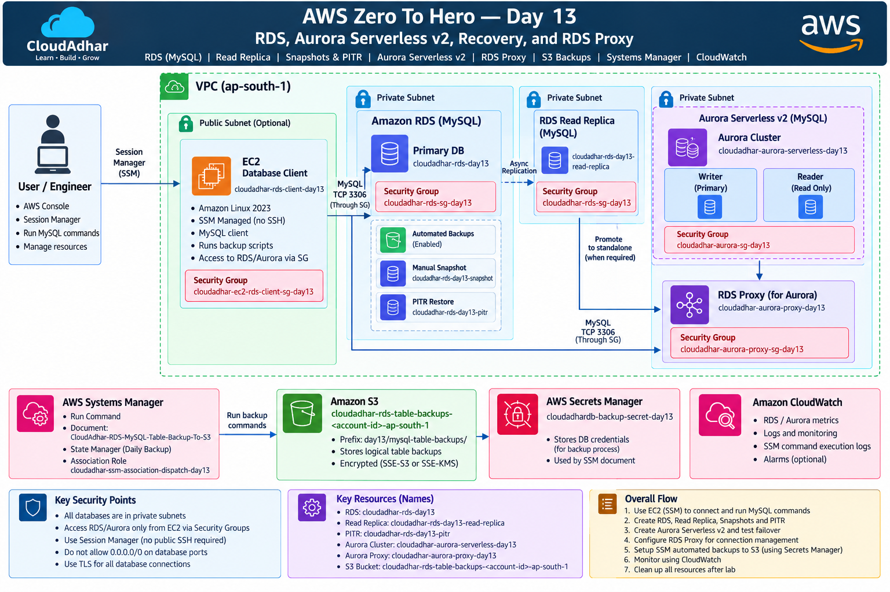

## 2. Lab Objectives

• Deploy and connect to a private RDS MySQL database.

• Use TLS for MySQL connections.

• Understand automated backups, manual snapshots and Point-in-Time Recovery (PITR).

• Create and validate an RDS read replica.

• Understand Aurora Serverless v2 writer/reader architecture.

• Demonstrate Aurora failover concept.

• Use RDS Proxy for connection pooling.

• Automate a logical MySQL table backup with Systems Manager and upload it to private S3.

• Use Secrets Manager for backup credentials.

• Use CloudWatch for monitoring and logs.

• Understand Global Database and AWS DMS as decision exercises.

## 3. Resource Design

## 4. Network & Security

Database resources are intended to stay private. The main security path is:

EC2 Client SG → TCP 3306 → RDS SG

For Aurora Proxy: EC2 Client SG → TCP 3306 → Proxy SG → TCP 3306 → Aurora DB SG

• No database access from 0.0.0.0/0.

• Use Systems Manager instead of public SSH where possible.

• Use TLS for MySQL connections.

• Keep credentials in Secrets Manager rather than scripts.

• Do not expose passwords, tokens or secrets in screenshots.

## 5. RDS Creation & Deployment Choice

The supplied AWS console evidence shows the RDS database creation screen with Full configuration, Dev/Test template and Single-AZ DB instance deployment selected for the disposable lab.

RDS creation screen — Full configuration, Dev/Test and Single-AZ selected

## 6. Connect to RDS from EC2

The EC2 client connects to the private RDS endpoint using a MySQL-compatible client and TLS.

Example connection pattern:

mysql -h <rds-endpoint> -P 3306 -u admin -p \
  --ssl-ca=global-bundle.pem \
  --ssl-verify-server-cert \
  cloudadhardb

Successful MySQL/MariaDB connection to the RDS endpoint

## 7. Database & Table Validation

The practical creates a training database and validates a sample users table.

CREATE DATABASE day13_test;
USE day13_test;

CREATE TABLE users (
  id INT PRIMARY KEY,
  name VARCHAR(50),
  email VARCHAR(100)
);

Database creation — day13_test

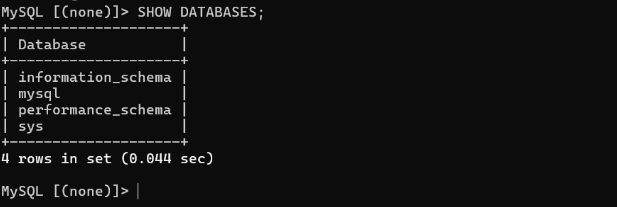

users table structure — id primary key, name and email

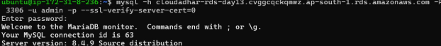

Data/count validation for the users table

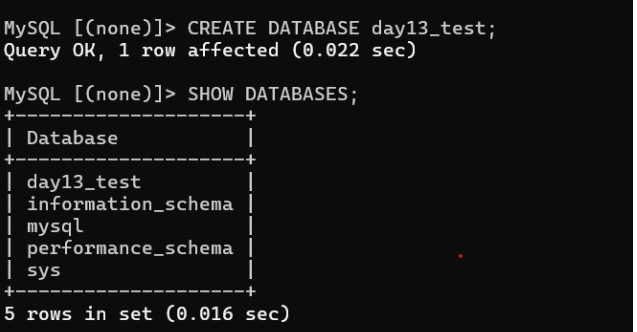

## 8. RDS Backups & Manual Snapshot

RDS automated backups provide the foundation for Point-in-Time Recovery. A manual snapshot provides an explicit recovery point and can be restored into a separate database instance.

• Automated backups → continuous recovery window for PITR.

• Manual snapshot → explicit point-in-time copy.

• Restore operations create a new database; the source is not overwritten.

RDS settings / backup-related evidence

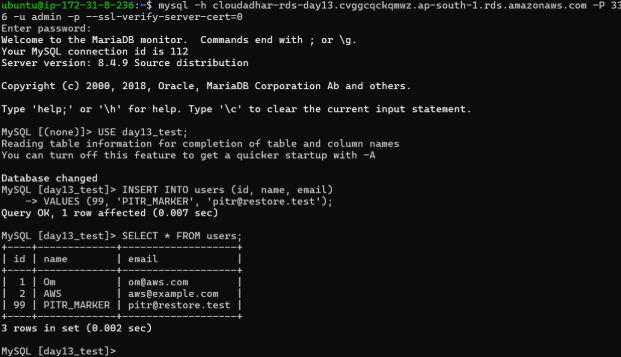

## 9. Point-in-Time Recovery (PITR)

The PITR exercise creates a marker record, records the time, deletes the marker, then restores the database to a time before deletion.

INSERT INTO orders (customer_name, product_name, amount)
VALUES ('PITR Marker', 'Recover This Record', 1500.00);

SELECT UTC_TIMESTAMP() AS marker_created_utc;

DELETE FROM orders
WHERE customer_name = 'PITR Marker';

SELECT ROW_COUNT() AS deleted_rows;
SELECT UTC_TIMESTAMP() AS deletion_time_utc;

PITR marker creation / timestamp evidence

PITR deletion evidence

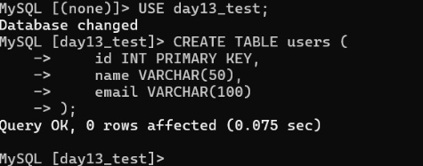

## 10. PITR Recovery Logic

Recovery flow:

→ Create marker

→ Record UTC timestamp

→ Delete marker

→ Choose a recovery minute before deletion

→ Restore to a NEW RDS instance

→ Connect to the restored database

→ Verify the marker exists

## 11. RDS Read Replica

The lab uses an asynchronous read replica for read scaling.

Primary → asynchronous replication → cloudadhar-rds-day13-read-replica

Validation can include:

SELECT @@global.read_only;
SHOW REPLICA STATUS\G

Expected concepts: the replica is read-only, data arrives asynchronously, and writes are directed to the primary.

## 12. Aurora Serverless v2

Aurora Serverless v2 is introduced as a cluster with writer and reader capacity.

Cluster: cloudadhar-aurora-serverless-day13

Reader: cloudadhar-aurora-serverless-day13-reader-1

Writer endpoint handles writes; reader endpoint is intended for read traffic.

## 13. Aurora Failover

The practical records the current writer, performs a controlled failover, then verifies the new writer. The stable cluster endpoint should continue to be used by applications.

Pass conditions:

• Backend writer changes

• Cluster endpoint remains stable

• New writer is read/write

• Existing data remains

• A new write succeeds

## 14. RDS Proxy

RDS Proxy sits between the client/application and Aurora and provides connection pooling/reuse.

EC2 → RDS Proxy → Aurora

Proxy is not a query cache and does not replace Aurora reader endpoints.

## 15. Systems Manager → S3 Logical Backup

The lab automates a logical backup of the orders table using Systems Manager. The EC2 client retrieves database credentials from Secrets Manager, performs a TLS MySQL dump, compresses it and uploads it to private S3.

Automation:

→ State Manager association

→ SSM Command Document

→ Secrets Manager

→ MySQL over TLS

→ mysqldump / SQL export

→ gzip compression

→ Private S3 upload

→ CloudWatch logs

## 16. Backup Restore Test

Logical backups are restored into an isolated schema, not over the active database.

CREATE DATABASE cloudadhardb_restore_test;
USE cloudadhardb_restore_test;
SOURCE /tmp/<backup-file>.sql;
SHOW TABLES;
SELECT COUNT(*) FROM orders;
DROP DATABASE cloudadhardb_restore_test;

## 17. Secrets Manager & Least Privilege

The backup workflow uses a dedicated secret and backup user rather than the master database account.

CREATE USER 'backup_user'@'%' IDENTIFIED BY '<strong-unique-password>';
GRANT SELECT ON cloudadhardb.orders TO 'backup_user'@'%';

The principle is least privilege: the backup process receives only the database access required for its job.

## 18. CloudWatch Monitoring

CloudWatch is used for database metrics, logs, backup/SSM execution logs and general observability. It helps verify that the practical is behaving as expected without relying only on the console configuration screens.

## 19. Global Database & AWS DMS — Decision Exercises

These are decision/architecture exercises and should not be deployed in the disposable lab without approval.

## 20. Evidence Gallery

The screenshots below are embedded as task-specific evidence rather than generic Proof 1 / Proof 2 labels.

RDS console state

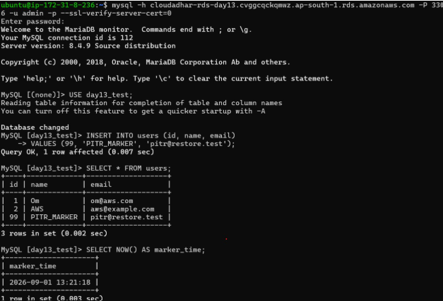
Final database state / validation

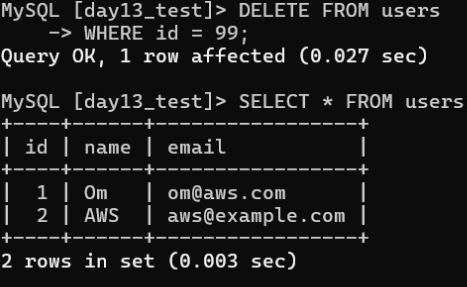
Backup/PITR marker evidence

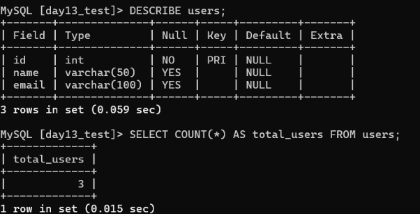

## 21. Final Verification Checklist

☐ Private RDS connectivity works from the EC2 client.

☐ TLS connection is successful.

☐ Training database/table/data are validated.

☐ Manual snapshot exists.

☐ Automated backups are configured.

☐ PITR marker/recovery validation is complete.

☐ Read replica is available and read-only.

☐ Aurora writer/reader architecture is understood and tested.

☐ Aurora failover validation is complete.

☐ RDS Proxy connectivity is tested.

☐ S3 logical backup object is created.

☐ Secrets Manager credential is used by the backup process.

☐ SSM Command Document runs successfully.

☐ State Manager scheduled association is healthy.

☐ Logical restore is validated in an isolated schema.

☐ CloudWatch logs/metrics are available.

☐ Temporary/billable resources are cleaned up after evidence capture.

## 22. Cleanup

• Delete the temporary Function/automation resources that are no longer required.

• Delete the RDS source database when the lab is finished.

• Delete the read replica.

• Delete the PITR restored instance.

• Delete Aurora instances/cluster if created only for the lab.

• Delete RDS Proxy.

• Remove unnecessary snapshots.

• Remove S3 backup objects and bucket if no longer needed.

• Remove temporary Secrets Manager resources.

• Remove temporary IAM roles/policies after dependency checks.

• Terminate the EC2 client if it is no longer required.

• Verify that no billable resources remain.

End of CloudAdhar Day 13 Practical Documentation

## 23. Additional Practical Evidence — PITR

The following additional screenshots were supplied after the first documentation version. They are embedded here as task-specific evidence.

PITR source database after deleting the marker row

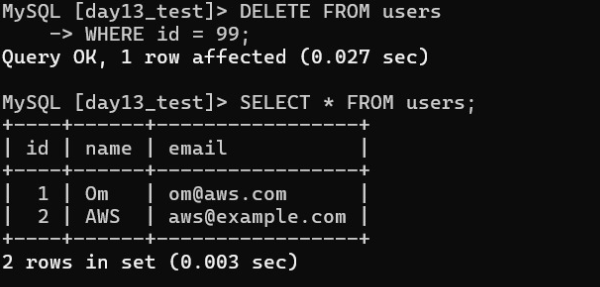

PITR restored database — PITR_TEST_3 record is present

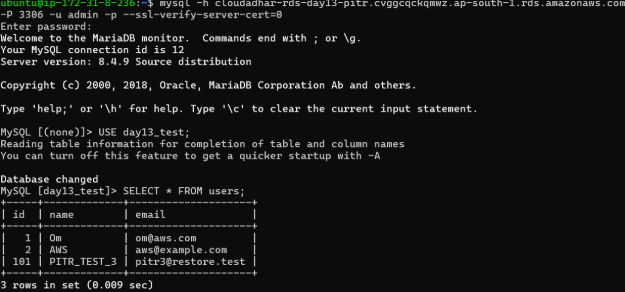

## 24. Additional Practical Evidence — Multi-AZ & Read Replica

The lab also captured the RDS availability configuration and read-replica lifecycle.

RDS Availability & durability — Multi-AZ deployment configuration

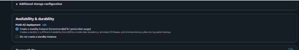

RDS instance modification summary — credential management / immediate application

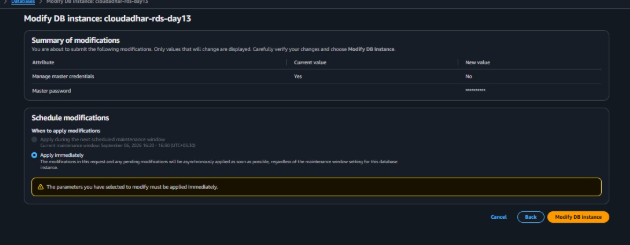

RDS instance modification summary — duplicate evidence of the applied configuration

RDS console — primary and read replica creation in progress

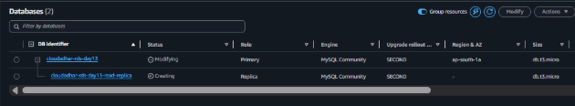

Primary database data after inserting REPLICA_TEST record

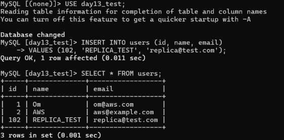
Promote read replica — cloudadhar-rds-day13-read-replica

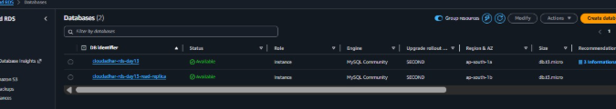

RDS console — primary and read replica both Available in different AZs

## 25. Additional Practical Evidence — Aurora Serverless v2

The Aurora creation configuration shows the cluster identifier, Aurora MySQL engine, Secrets Manager credential management and Aurora Standard storage configuration.

Aurora Serverless v2 creation settings — cluster identifier, Secrets Manager and Aurora Standard

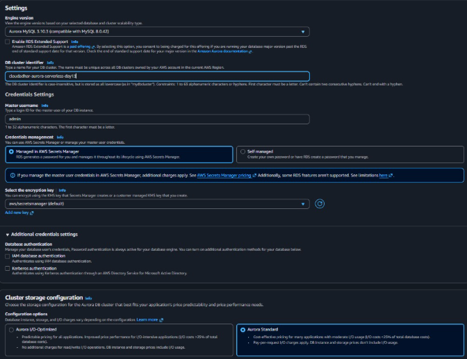

## 26. Evidence-to-Task Mapping

PITR recovery: Marker deletion + restored database containing PITR_TEST_3

Multi-AZ: Availability & durability configuration screenshot

Credential management: RDS modification summary showing managed credential setting

Read replica creation: RDS console showing primary and replica lifecycle

Replication validation: REPLICA_TEST inserted into source data

Replica promotion: Promote read replica screen

Replica availability: Both primary and replica shown Available in ap-south-1a / ap-south-1b

Aurora Serverless v2: Aurora MySQL cluster, Secrets Manager and storage configuration

## 27. Final Evidence Checklist — Updated

☐ RDS creation and deployment choice captured

☐ MySQL/TLS connection captured

☐ Database and table creation captured

☐ Table data/count validation captured

☐ PITR marker/deletion captured

☐ PITR restored database captured with PITR_TEST_3

☐ RDS Multi-AZ configuration captured

☐ RDS credential-management modification captured

☐ Read replica creation captured

☐ Source data for replication captured

☐ Read replica promotion captured

☐ Primary and replica Available state captured

☐ Aurora Serverless v2 settings captured

☐ Architecture diagram embedded

☐ Backup / SSM / S3 workflow documented

☐ Cleanup checklist documented

## 28. Newly Supplied Evidence — Task-wise

The following screenshots were supplied after the previous documentation version. Each image is placed under the task it proves, rather than being labelled only as Proof 1, Proof 2, etc.

### 28.1 Aurora Database Creation

Task: Aurora database creation — cloudadhar-rds-sg-day13 created successfully
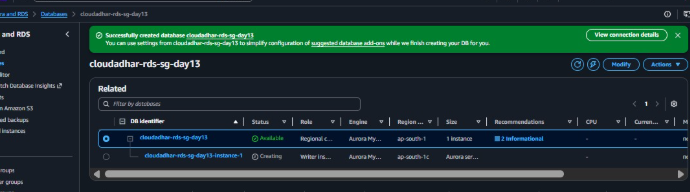

### 28.2 Aurora Serverless v2 Cluster Creation / Lifecycle

Task: Aurora Serverless v2 cluster lifecycle — cluster and writer instance

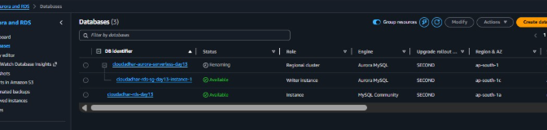

### 28.3 Aurora Serverless v2 Final Writer + Reader State

Task: Aurora Serverless v2 final state — cluster, reader and writer instances Available

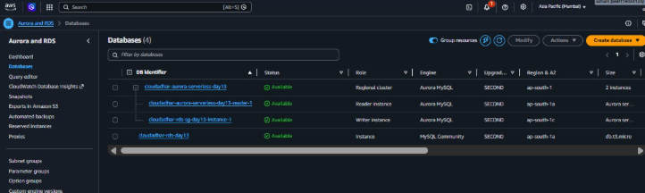

### 28.4 Aurora Writer Database Validation

Task: Aurora writer database validation — cloudadhardb and aurora_test

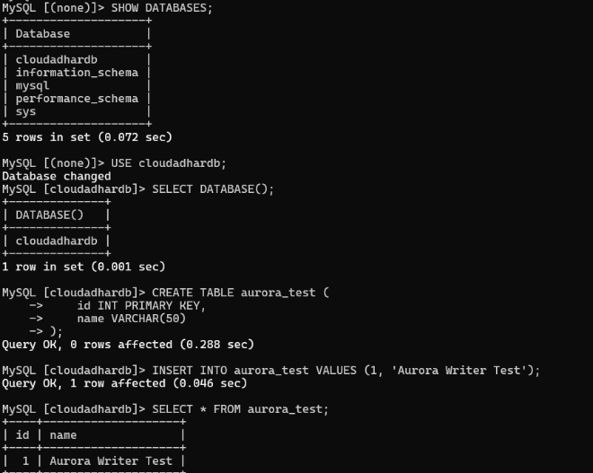

### 28.5 Aurora Failover Validation

Task: Aurora failover validation — new writer is read/write and data is preserved

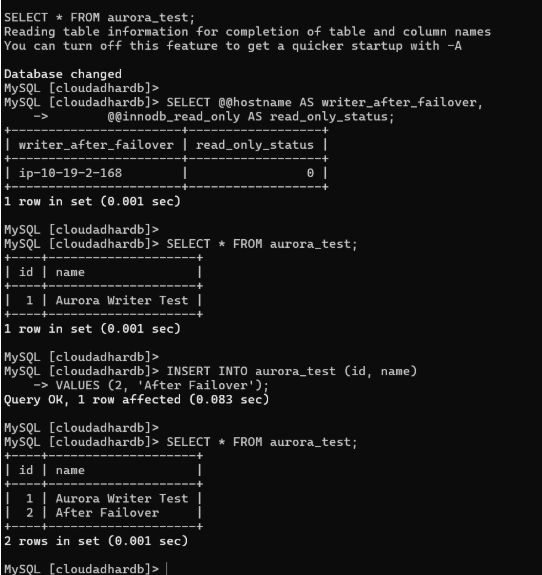

### 28.6 RDS Proxy — Read-only Endpoint

Task: RDS Proxy read-only endpoint — SELECT works and INSERT is rejected

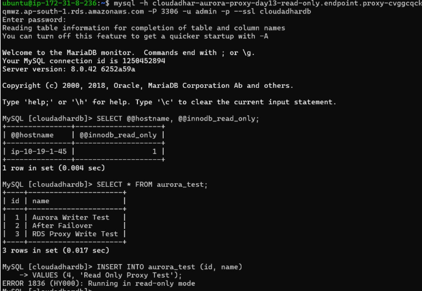

### 28.7 RDS Proxy — Writer Endpoint

Task: RDS Proxy writer endpoint — write succeeds through proxy

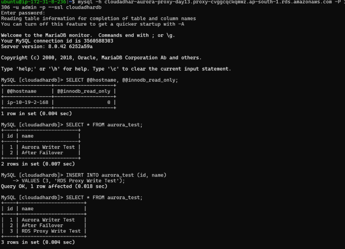

### 28.8 S3 Backup Bucket Creation

Task: S3 backup bucket creation — private backup bucket created

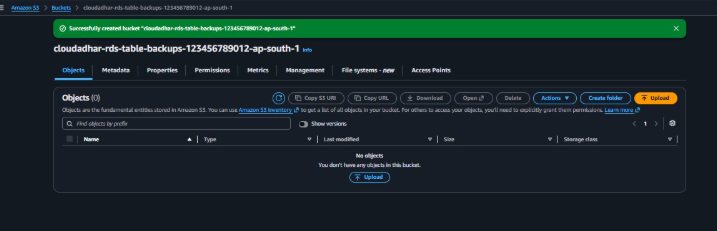

### 28.9 S3 Logical Backup Object

Task: S3 logical backup — compressed SQL backup object exists under mysql-table-backups/

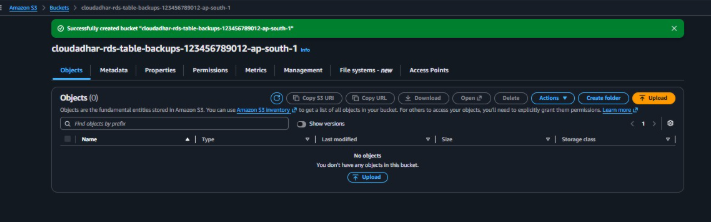

### 28.10 Logical Backup Restore Validation

Task: Logical backup restore — restored_rows = 3 and temporary restore database cleaned up

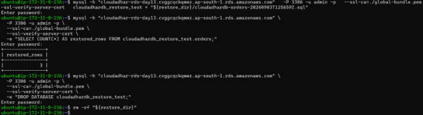

### 28.11 Systems Manager Run Command Success

Task: Systems Manager automation — Run Command completed successfully

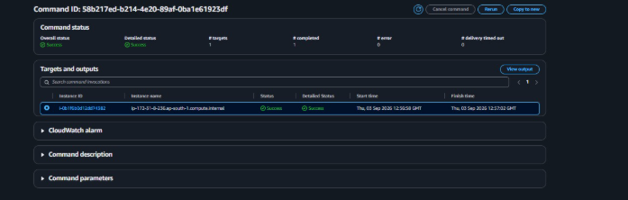

## 29. Updated End-to-End Task Flow

1. RDS database and security configuration

2. RDS MySQL connectivity over TLS

3. Database/table/data validation

4. RDS automated backup and snapshot concepts

5. PITR marker → deletion → recovery into a new database

6. Read replica creation → replication validation → promotion

7. Aurora Serverless v2 cluster → writer/reader validation

8. Aurora failover → new writer validation

9. RDS Proxy writer endpoint → successful write

10. RDS Proxy read-only endpoint → write correctly rejected

11. S3 backup bucket → compressed logical SQL backup object

12. Logical backup → isolated restore → row-count validation → cleanup

13. Systems Manager Run Command → successful automation execution

14. Cleanup and cost verification

## 30. Updated Evidence Checklist

☐ Aurora database creation success

☐ Aurora cluster lifecycle / writer creation

☐ Aurora final cluster with writer and reader Available

☐ Aurora writer database and table validation

☐ Aurora failover writer_after_failover = read_only_status 0

☐ RDS Proxy read-only endpoint validation

☐ RDS Proxy writer endpoint validation

☐ S3 backup bucket creation

☐ S3 .sql.gz backup object

☐ Logical restore returned 3 rows and cleanup completed

☐ SSM Run Command status Success

☐ Previously supplied RDS, PITR, read replica and Aurora configuration evidence

☐ Architecture diagram

## Extracted Evidence Tables

| EC2 Client | cloudadhar-rds-client-day13 |
| --- | --- |
| RDS MySQL | cloudadhar-rds-day13 |
| Aurora Cluster | cloudadhar-aurora-serverless-day13 |
| RDS Proxy | cloudadhar-aurora-proxy-day13 |
| Backup Bucket / SSM | S3 logical backups + Systems Manager automation |

| Resource | Name | Purpose |
| --- | --- | --- |
| EC2 client | cloudadhar-rds-client-day13 | Database client / SSM managed node |
| RDS MySQL | cloudadhar-rds-day13 | Primary relational database |
| Snapshot | cloudadhar-rds-day13-snapshot | Manual recovery point |
| PITR restore | cloudadhar-rds-day13-pitr | Point-in-time recovery target |
| Read replica | cloudadhar-rds-day13-read-replica | Asynchronous read scaling |
| Aurora | cloudadhar-aurora-serverless-day13 | Serverless relational cluster |
| Aurora reader | cloudadhar-aurora-serverless-day13-reader-1 | Read workload |
| RDS Proxy | cloudadhar-aurora-proxy-day13 | Connection pooling |
| S3 | Day 13 backup bucket | Logical backup storage |
| SSM | CloudAdhar-RDS-MySQL-Table-Backup-To-S3 | Backup automation |

| Technology | Use case |
| --- | --- |
| Aurora Global Database | Cross-Region reads / disaster recovery |
| AWS DMS | Migration with full load + CDC |

---

## Evidence Index

| Task | Evidence |
|---|---|
| Aurora database creation | Database created successfully |
| Aurora Serverless v2 | Cluster with writer/reader instances |
| Aurora validation | `cloudadhardb` and `aurora_test` validated |
| Aurora failover | New writer validated as read/write and data preserved |
| RDS Proxy read-only | SELECT succeeds; INSERT is rejected |
| RDS Proxy writer | INSERT succeeds through writer proxy endpoint |
| S3 backup | Backup bucket and `.sql.gz` object verified |
| Logical restore | Restore returned 3 rows and temporary DB was cleaned |
| Systems Manager | Run Command completed successfully |
| RDS PITR | Deletion and restored database evidence |
| Read replica | Creation, replication, promotion and Available state |
| Multi-AZ | Availability and durability configuration |
| Architecture | End-to-end AWS architecture included in source documentation |

## Final Evidence Checklist

- [ ] RDS creation and security configuration
- [ ] MySQL/TLS connectivity
- [ ] Database/table/data validation
- [ ] Automated backup / snapshot concepts
- [ ] PITR marker → deletion → recovery
- [ ] Read replica creation → validation → promotion
- [ ] Aurora Serverless v2 cluster → writer/reader validation
- [ ] Aurora failover validation
- [ ] RDS Proxy read-only validation
- [ ] RDS Proxy writer validation
- [ ] S3 backup bucket and logical backup object
- [ ] Logical restore and cleanup
- [ ] Systems Manager Run Command success
- [ ] Cleanup and cost verification